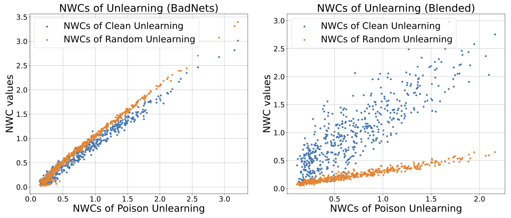
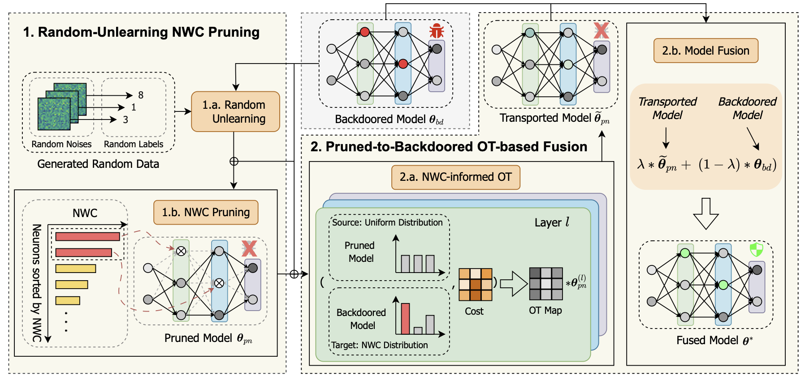

# Fusing Pruned and Backdoored Models: Optimal Transport-based Data-free Backdoor Mitigation
> The official code implementation for the backdoor defense method, **OTBR**: [arXiv:2408.15861](https://arxiv.org/abs/2408.15861). 

We propose to defend against backdoor attacks in a **data-free** manner using pruning and optimal transport(OT)-based model fusion. 


## Overview
### Finding
<div align=center>

</div>

We observe that the *neuron weight changes* (NWCs) of random unlearning exhibit a positive correlation with those of poison unlearning. This motivates us to adopt NWCs for data-free backdoor mitigation using only the generated random noise.

### Framework

Overview of our proposed OTBR. 

- In Stage 1, referred to as *random-unlearning NWC pruning*, we aim to obtain a backdoor-free model by pruning the neurons with high NWC during random unlearning, which are considered more backdoor-related.
- In Stage 2, referred to as *pruned-to-backdoored OT-based fusion*, when obtaining a sub-optimal pruned model, we aim to combine its low ASR with the high ACC of the original backdoored model by repairing the backdoor-related neurons using OT-based model fusion.

## Quick Start
### Code File Placement
Note that our code is implemented based on [BackdoorBench](https://github.com/SCLBD/BackdoorBench.git).
Please clone the official code first, and then place our code to the corresponding folders. We provide a configuration file `otbr/config.yaml` and the implemetation code `otbr.py`. Please place them under `./config/defense/` folder and `./defense/` folder, respectively:
```
|-- config
    |-- defense
        |-- otbr/config.yaml
|-- defense
    |-- otbr.py
```
### Defense


This is a demo script of running OTBR defense on CIFAR-10 for BadNets attack. Before defense, you need to obtain the attacked model first. Then, you may use the corresponding result folder name as `result_file` (badnet_0_1 as the example below) and run OTBR:

```
python ./defense/otbr.py --result_file badnet_0_1 --yaml_path ./config/defense/otbr/cofig.yaml --dataset cifar10
```
You can conduct OTBR for other attacks in a similar way. We provide an attack example below. More detailed instructions can be found in [https://github.com/SCLBD/BackdoorBench](https://github.com/SCLBD/BackdoorBench).

### Attack

To obtain the attacked models, you can either download the [open-sourced checkpoints by BackdoorBench](http://backdoorbench.com/model_zoo) or run your own one as below.

This is an attack example using BadNets:
```
python ./attack/badnet.py --yaml_path ../config/attack/prototype/cifar10.yaml --patch_mask_path ../resource/badnet/trigger_image.png  --save_folder_name badnet_0_1
```
After attack you will get a folder with all files saved in `./record/<folder name in record>`, including `attack_result.pt` for attack model and backdoored data, which will be used by following defense methods.

## Citation
If you find this project useful in your research, please consider cite:
```
@article{lin2024fusing,
  title={Fusing Pruned and Backdoored Models: Optimal Transport-based Data-free Backdoor Mitigation},
  author={Lin, Weilin and Liu, Li and Li, Jianze and Xiong, Hui},
  journal={arXiv preprint arXiv:2408.15861},
  year={2024}
}

@inproceedings{backdoorbench,
  title={BackdoorBench: A Comprehensive Benchmark of Backdoor Learning},
  author={Wu, Baoyuan and Chen, Hongrui and Zhang, Mingda and Zhu, Zihao and Wei, Shaokui and Yuan, Danni and Shen, Chao},
  booktitle={Thirty-sixth Conference on Neural Information Processing Systems Datasets and Benchmarks Track},
  year={2022}
}
```